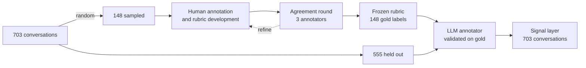
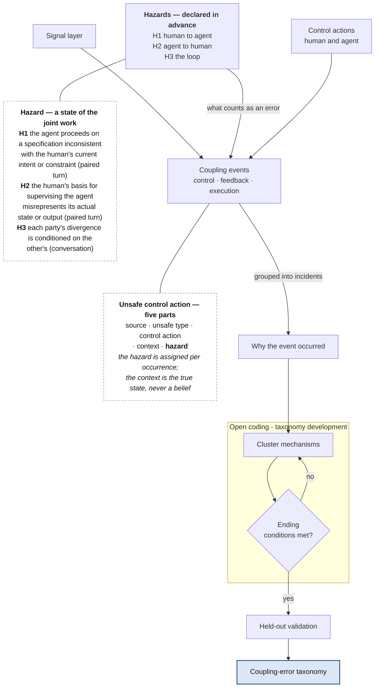

# Figure sources

Mermaid source for the two Method-section figures. Captions live with the figures in `paper/methods.md` (§3.2, §3.3). Rendered: the published artifact. Convert to TikZ for submission.

## Figure 1 — Stage 1

## Figure 2 — Stage 2

